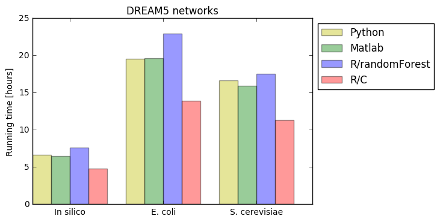

# GENIE3
Machine learning-based approach for the inference of gene regulatory networks from expression data.

The GENIE3 method is described in the following paper:
```
Huynh-Thu V. A., Irrthum A., Wehenkel L., and Geurts P. (2010)
Inferring regulatory networks from expression data using tree-based methods.
PLoS ONE, 5(9):e12776.
```

The paper is available [here](http://journals.plos.org/plosone/article?id=10.1371/journal.pone.0012776).

Four implementations of GENIE3 are available: Python, MATLAB, R/randomForest, and R/C. Each folder contains a PDF file with a step-by-step tutorial showing how to run the code.

Note 1: The R/C implementation can also be installed from [Bioconductor](https://bioconductor.org/packages/devel/bioc/html/GENIE3.html). 

Note 2: All the results presented in the *PLoS ONE* paper were generated using the MATLAB implementation.

GENIE3 is based on regression trees. To learn these trees, the Python implementation uses the [scikit-learn](http://scikit-learn.org/stable/) library, the MATLAB and R/C implementations are respectively MATLAB and R wrappers of a C code written by [Pierre Geurts](http://www.montefiore.ulg.ac.be/~geurts/), and the R/randomForest implementation uses the [randomForest](https://cran.r-project.org/web/packages/randomForest/index.html) R package.
The R/C implementation is the fastest GENIE3 implementation, and was developed for the SCENIC pipeline to analyze single-cell RNA-seq data (Aibar Santos et al., Nature Methods, 14:1083-1086, 2017.).
The running times of the different GENIE3 implementations are shown below for the DREAM5 networks (in each case, GENIE3 was run using the default parameters). These computing times were measured on a 16GB RAM, Intel Xeon E5520 2.27GHz computer. 



GENIE3 was the best performer in two [DREAM challenges](http://dreamchallenges.org/): the DREAM4 *In Silico Size 100 Multifactorial* sub-challenge and the DREAM5 *Network Inference* challenge.